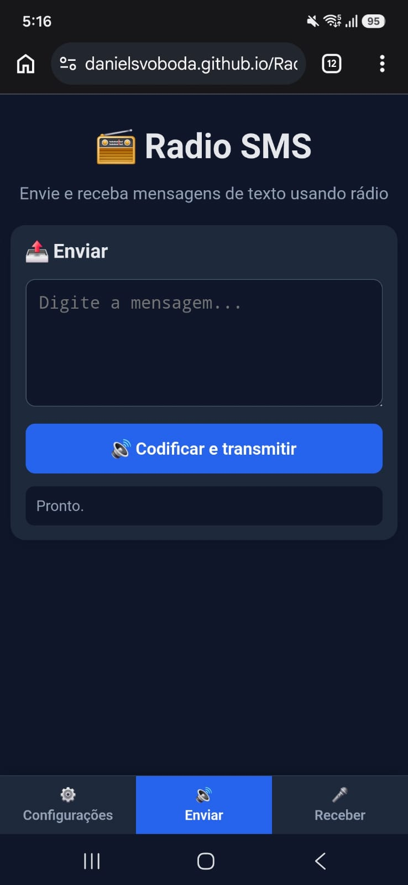
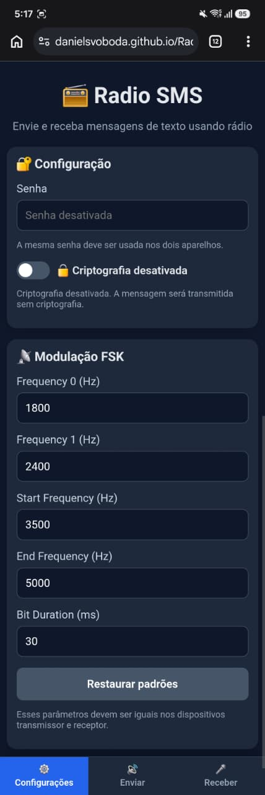

# 📻 Radio SMS

> Comunicação de mensagens de texto por rádio/áudio utilizando **FSK**, com suporte opcional a **AES-256-GCM**.

🌐 https://danielsvoboda.github.io/RadioSMS/

---

## 📡 Sobre

O **Radio SMS** é uma aplicação web experimental que permite transmitir e receber mensagens de texto através de sinais de áudio.

A mensagem é convertida em bits e modulada utilizando **FSK (Frequency Shift Keying)**. O receptor captura o áudio pelo microfone e reconstrói a mensagem.

### ✨ Recursos

* 📤 Transmissão de mensagens por áudio/radio
* 🎤 Recepção pelo microfone
* 📡 Modulação FSK
* 🔐 Criptografia opcional AES-256-GCM
* ⚙️ Frequências e duração dos bits configuráveis
* 🌐 Funciona diretamente no navegador

---

## 🖥️ Interface

### ⚙️ Configuração

Permite configurar os parâmetros de comunicação e ativar ou desativar a criptografia.


### 📤 Transmissão

Digite a mensagem e inicie a codificação e transmissão do sinal.



### 🎤 Recepção

O microfone captura o sinal FSK e realiza a demodulação da mensagem.



---

## 🔐 Criptografia

O sistema suporta **AES-256-GCM** opcionalmente.

Quando ativada, a mensagem é criptografada antes da transmissão. O transmissor e o receptor devem utilizar a **mesma senha**.

```text
Mensagem
   ↓
Criptografia (opcional)
   ↓
Codificação FSK
   ↓
📡 Áudio/Rádio
   ↓
Decodificação FSK
   ↓
Mensagem
```

---

## 📡 Parâmetros FSK

| Parâmetro       | Descrição             |
| --------------- | --------------------- |
| Frequency 0     | Frequência do bit `0` |
| Frequency 1     | Frequência do bit `1` |
| Start Frequency | Frequência inicial    |
| End Frequency   | Frequência final      |
| Bit Duration    | Duração de cada bit   |

> Os dispositivos devem utilizar os mesmos parâmetros de comunicação.

---

## 🚀 Como utilizar

1. Acesse **https://danielsvoboda.github.io/RadioSMS/**
2. Configure os mesmos parâmetros no transmissor e receptor.(ou deixe tudo como padrão)
3. Se desejar, ative a criptografia e utilize a mesma senha.
4. No transmissor, digite a mensagem e clique em **🔊 Codificar e transmitir**.
5. No receptor, clique em **🎤 Iniciar microfone** e aguarde a transmissão.

---

## 🛠️ Tecnologias

* HTML
* CSS
* JavaScript
* Web Audio API
* FSK
* AES-256-GCM
* Processamento de sinais de áudio

---

## ⚠️ Limitações

A qualidade da comunicação depende de fatores como **ruído, distância, volume, microfone, rádio e interferências**.

O projeto possui caráter **experimental e educacional**, voltado ao estudo de comunicação digital por áudio/radio.
